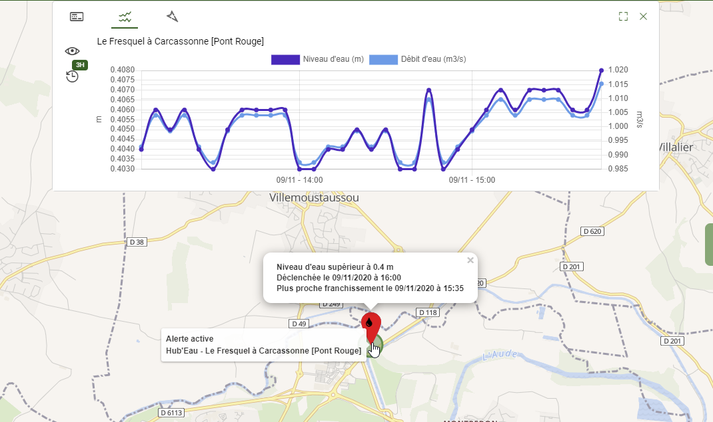

# <i class="las la-bell"></i> Alertes environnementales

Les **alertes environnementales** permettent de générer un [événement](../quickstart/concepts.md#evenement) de façon automatique dès lors que des conditions spécifiques se rencontrent sur votre territoire au sein de nos données environnementales. Typiquement il s'agit de détecter:
* des conditions météorologiques dangereuses à surveiller comme par exemple une vitesse de vent supérieure à 100 Km/h sur une zone sensible,
* des niveaux guides ou des seuils à surveiller comme par exemple un niveau de crue centennal sur une rivière.

Les alertes vous permettent ainsi d'assurer simplement vos opérations de vigilance quotidienne de façon fiable et de mobiliser vos équipes rapidement si nécessaire.

::: warning Note
Cette fonctionnalité requiert l'abonnement pour accéder au [catalogue des données environnementales](./catalog.md). Sans celui-ci, vous ne pourrez pas y accéder.
:::

## Création d'une alerte

Il est possible de créer une alerte depuis le [catalogue cartographique](./catalog.md) en activant tout d'abord la couche de données cible via le [panneau latéral](./catalog.md#panneau-lateral). Vous pouvez par exemple choisir des [prévisions météorologiques](./catalog.md#prevision-meteorologiques) comme le vent ou des mesures comme les [mesures hydrométriques Hub'Eau](./catalog.md#hub-eau).

Pour les prévisions météorologiques il vous suffit de faire un clic droit à la position où vous souhaitez surveiller les variations sur la carte. L'action vous permettant de créer une alerte <i class="las la-bell"></i> apparait alors dans le [menu contextuel](./catalog.md#menu-contextuel). De la même façon, elle apparait lors d'un clic droit sur la sonde où vous souhaitez surveiller les variations pour des données de mesures. Le composant permettant de paramétrer votre alerte est découpé en plusieurs sections:
  
<i class="las la-clock la-2x"></i> La fréquence de vérification des conditions d'alerte ainsi que la plage temporelle d'analyse. Pour des mesures il s'agit de la plage de temps dans le passé au sein de laquelle sont recherchées les conditions de déclenchement. Pour les prévisions météorologiques il s'agit de la plage de temps dans le futur au sein de laquelle sont recherchées les conditions de déclenchement. 

<i class="lab la-cloudversify la-2x"></i> Les conditions à satisfaire pour déclencher l'alerte sous la forme d'un seuil à (ou ne pas) dépasser pour chaque élément météorologique ou mesure d'intérêt parmi ceux disponibles.

<i class="las la-bell la-2x"></i> Le modèle d'événement à créer lorsque l'alerte est déclenchée, tout en précisant s'il doit également être automatiquement clôturé lorsque l'alerte n'est plus active.

::: warning Note
Etant donné que l'événement sera automatiquement créé par l'application lorsque les conditions de l'alerte seront rencontrées, le modèle doit contenir au moins un participant et un coordonnateur.
:::

