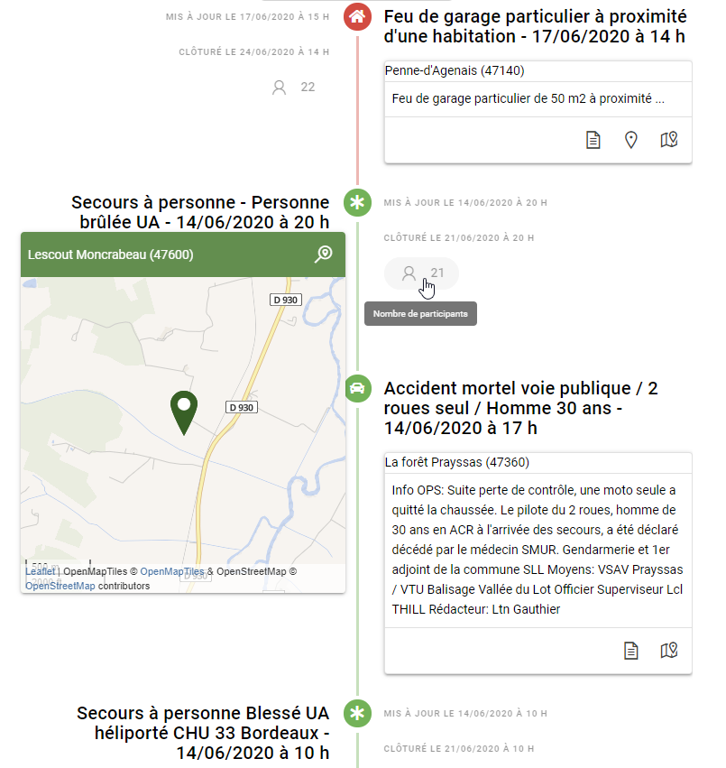
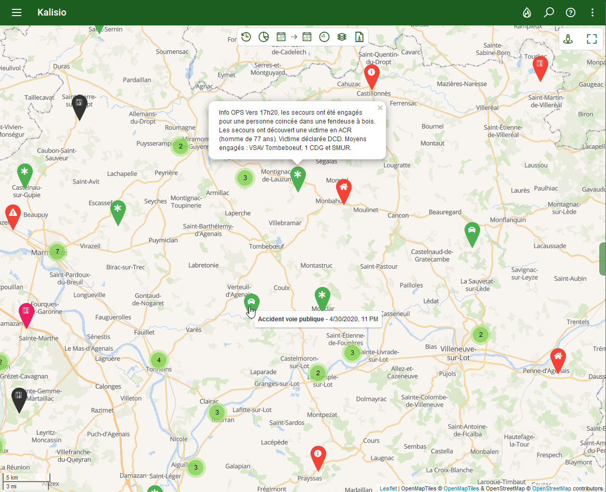
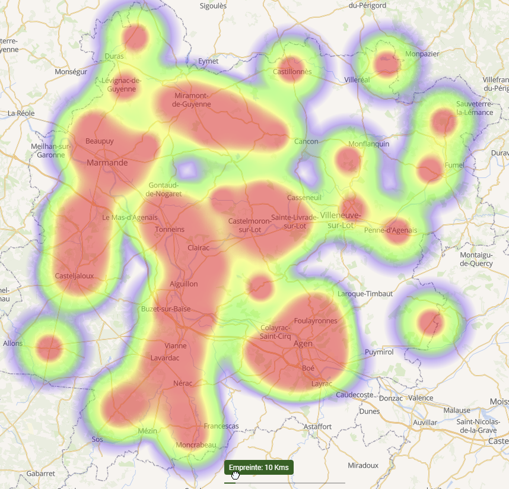
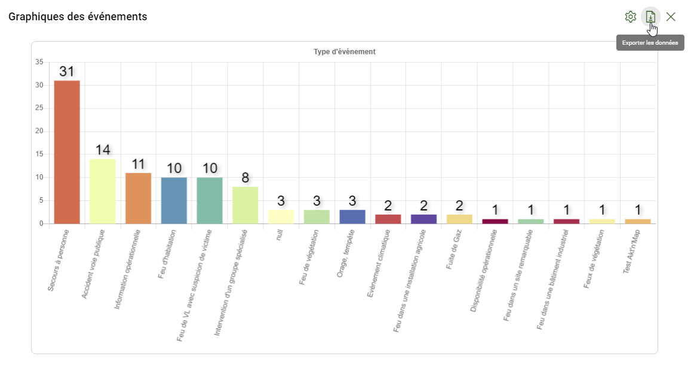

# <i class="las la-clipboard-list"></i> Main courante

La **main courante** propose un archivage long-terme de vos [événements](../quickstart/concepts.md#evenement). Elle vous permet ainsi d'assurer une traçabilité complète de vos opérations et la production de statistiques sous forme de graphiques ou de cartes.

::: warning Note
Cette fonctionnalité requiert un abonnement spécifique. Sans celui-ci, vous ne pourrez pas y accéder.

:point_right: Vous êtes propriétaire d'une organisation ? <ClientOnly><tour-link text="Voir comment souscrire" path="home" :params="{ organisation: 'owner', route: 'edit-organisation-billing' }"/></ClientOnly>
:::

La vue par défaut au sein de cette activité propose une **ligne de temps** ou **historique** affichant vos événements de façon séquentielle dans une plage de temps donnée. Vous pourrez y retrouver les actions afférentes habituelles, ainsi que de nouvelles information de traçabilité comme les dates de création/modification/clôture et le nombre de participants impliqués: 

::: danger Attention
Une fois archivées, les données produites par l'application sont anonymisées en supprimant les identifiants personnels tels que les noms, ceci afin de limiter vos obligations juridiques en vertu du [RGPD](https://fr.wikipedia.org/wiki/R%C3%A8glement_g%C3%A9n%C3%A9ral_sur_la_protection_des_donn%C3%A9es), mais aussi pour protéger les individus et leurs données personnelles.

Néanmoins, le contenu saisi par vos membres est enregistré "tel quel". Aussi, vous devez vous assurez de sa conformité avec le RGPD.
:::

Il est également possible de basculer sur une vue cartographique de vos événements permettant leur localisation précise:

Ou sous forme de carte de densité pour étudier leur distribution spatiale:

Cerise sur le gâteau, vous pouvez produire des statistiques sur vos événements et exporter les données dans des applications tierces comme Microsoft® Excel®:

:point_right: Vous êtes gestionnaire d'une organisation ? <ClientOnly><tour-link text="Parcourir la main courante" path="home" :params="{ organisation: 'manager', route: 'archived-events-activity' }"/></ClientOnly>

::: details Voir aussi
Comment entrer dans l'activité de main courante depuis le <ClientOnly><tour-link text="tableau de bord" path="home/organisations"/></ClientOnly>

Comment afficher le tableau de bord depuis le <ClientOnly><tour-link text="menu principal" path="home" :params="{ tour: 'home' }"/></ClientOnly>
:::
