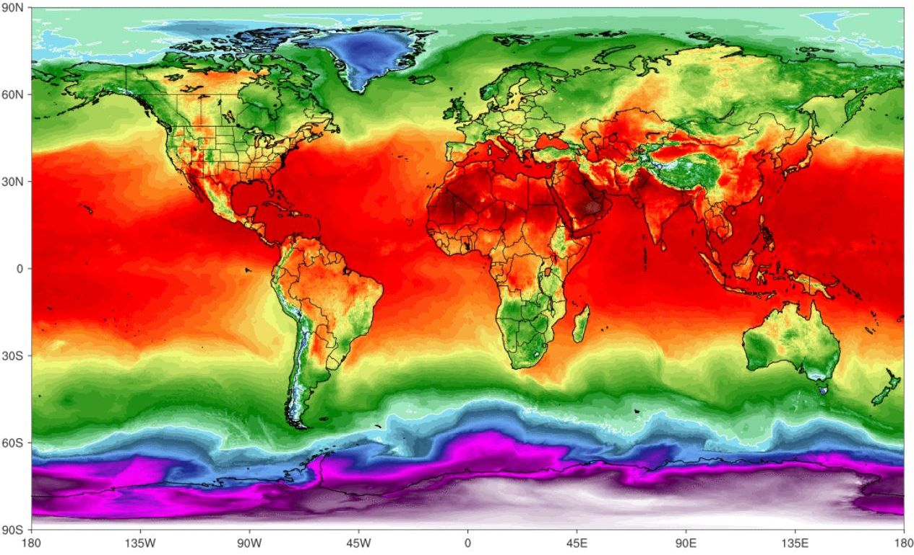

# Catalogue cartographique

Le catalogue cartographique permet de visualiser et d'interagir avec une carte numérique. Grâce aux technologies web les plus avancées, il permet le suivi de données géospatiales en temps-réel.

::: warning Note
Cette fonctionnalité requiert un abonnement spécifique, sans celui-ci vous ne pourrez y accéder.

:point_right: Vous êtes propriétaire d'une organisation ? <tour-link text="Voir comment souscrire" path="home" :params="{ organisation: 'owner', route: 'organisation-settings-activity', perspective: 'billing' }"/>
:::

## Concepts de base

Nous allons illustrer ici les *concepts de base* vous permettant de prendre en main la cartographie.

La carte peut contenir un **fond** (i.e. contexte géographique), un ensemble de **couches** (i.e. données métier), et possède une **extension** (i.e. la zone terrestre actuellement à l'écran), ainsi que des outils de navigation et de zoom. Une couche référence un jeu de données géospatiales et spécifie comment il est représenté (i.e. symbolisé) sur la carte. 

Une **couche d'entités** est un regroupement d'entités géographiques semblables, à savoir des bâtiments, des parcelles, des villes, des routes et des épicentres de tremblements de terre, par exemple. Les entités peuvent être ponctuelles, linéaires ou surfaciques (surfaces). Les couches d'entités sont adaptées à la visualisation des vos données métier superposées à vos fonds de carte. En utilisant le catalogue vous pouvez visualiser, sauvegarder, éditer et analyser vos propres entités et leurs propriétés. De plus, vous pouvez inclure une fenêtre contextuelle affichant des informations sur vos entités.

Le catalogue permet de gérer l'information **spatiale** de façon **temporelle** pour étudier des phénomènes géospatiaux *dépendant du temps* tels que: des objets se mouvant, l'historique des mesures prises par un capteur, les prévisions météorologiques, etc. Lorsqu'une couche affiche des données temporelles vous pouvez naviguer dans le temps à votre guise (passé, présent et futur) via une **ligne de temps**.

## Données

Le catalogue inclut un ensemble de données de base, auxquelles vous pouvez adjoindre vos propres données.

### OpenStreetMap

[OpenStreetMap](https://www.openstreetmap.org/) est un projet collaboratif de cartographie en ligne qui vise à constituer une base de données géographiques libre du monde. 

Ces données, au format [Vecteur](https://datacarpentry.org/organization-geospatial/02-intro-vector-data/index.html) sont dites sont structurées selon des thématiques données (bâtiments, utilisation du sol, etc.). Elles sont proposées selon différents styles de représentations (e.g. clair, sombre, topographique). Les données sont produites par [OpenMapTiles](https://openmaptiles.com/).

### Vigicrues

**Vigicrues** est une base de données qui stocke les données de vigilance des crues fournies par le service [Vigicrues](https://www.vigicrues.gouv.fr/). Ces données regroupent l'ensemble des cours d’eau intégrés au dispositif de vigilance crues sous la forme de tronçons. Chacun de ces tronçons stocke le niveau de vigilance nécessaire pour faire face aux dangers liés aux inondations susceptibles de se produire dans les 24 heures à venir.

Le niveau de risque de chacun est représenté à l'aide du code couleur suivant :
* **Rouge**: Risque de crue majeure. Menace directe et généralisée de la sécurité des personnes et des biens
* **Orange** : Risque de crue génératrice de débordements importants susceptibles d’avoir un impact significatif sur la vie collective et la sécurité des biens et des personnes
* **Jaune** : Risque de crue ou de montée rapide des eaux n'entraînant pas de dommages significatifs, mais nécessitant une vigilance particulière dans le cas d'activités saisonnières et/ou exposée
* **Vert** : Pas de vigilance particulière requise

Les données sont produites par le [Service central d’hydrométéorologie et d’appui à la prévision des inondations (SCHAPI)](https://www.ecologique-solidaire.gouv.fr/prevision-des-inondations)

### Hub'Eau

**Hydrométrie Hub'Eau** est une base de données qui stocke les données du référentiel hydrométrique (sites et stations d'observations du réseau français de mesures) ainsi que les observations de **hauteur d'eau** (H) et de **débit** (Q) dites "temps réel", enregistrées toutes les 5 à 60 minutes dans la plateforme **PHyC** (opérée par le [Service Central d’Hydrométéorologie et d’Appui à la Prévision des Inondations](https://www.ecologique-solidaire.gouv.fr/prevision-des-inondations)).

Les données sont mises à disposition via le portail [Hub'Eau](https://hubeau.eaufrance.fr/).

### Téléray

**Téléray** est une base de données qui stocke les mesures de radioactivité ambiante acquises par le [Réseau national de télémesure Téléray](https://www.irsn.fr/FR/connaissances/Environnement/surveillance-environnement/organisation/reseaux-surveillance/Pages/1-reseaux-telesurveillance.aspx#.XyM9qJ77QuU). 

Le **réseau Téléray** consiste en  un ensemble de balises de mesure de la radioactivité gamma ambiante. Les mesures sont exprimées en **nSv/h** (nanosievert par heure).

Les données sont produites par l'[Institut de Radioprotection et Sûreté Nucléaire (IRSN)](https://www.irsn.fr/FR/Pages/Home.aspx)

### OpenAQ

Données de qualité de l'air collectées dans 93 pays par l'association [OpenAQ](https://openaq.org/). Elles aggrègent des mesures de particules fines PM2.5, PM10, d'ozone (O3), de dioxide de soufre (SO2), de dioxide d'azote (NO2), de monoxide de carbone (CO), et de noir de carbone (BC). 

### Mapillary

Base de données de photos géolocalisées issues de la plateforme [Mapillary](https://www.mapillary.com/) et alimenté par production participative.

### GSMaP

Global Precipitation Measurement (GPM) est une mission opéré par plusieurs agences spatiales dont l'objectif est d'effectuer des mesures périodiques des précipitations au niveau de l'ensemble de la planète.

### Prévision météorologiques

Les éléments météorologiques disponibles sont les suivants :
* vitesse (m/s) et direction (°) du vent à 10m,
* rafales à 2m en m/s,
* température à 2m en °C,
* précipitations cumulées au sol (pluie et neige) sur 3h en mm/h.

Les données peuvent provenir de plusieurs modèles de prévision détaillées ci-après.

**ARPEGE** est le modèle prévisionnel de [Météo France](http://services.meteofrance.com/) grande échelle. Il existe deux variantes du modèle qui couvrent :
* Le globe avec une maille de 14 km (0.25°)
* L'Europe avec une maille de 5 km (0.1°)

Le modèle **ARPEGE** permet de prévoir les phénomènes de grande échelle (dépressions, anticyclones par exemple) qui parcourent le globe. Les données sont produites par **Météo France**.

**AROME** est le modèle prévisionnel de [Météo France](http://services.meteofrance.com/) dit régional à maille fine. Avec une maille de 2,5 km (0.025°), AROME couvre un domaine limité à la France métropolitaine et les pays voisins. Il est alimenté via ses bords latéraux par les simulations issues du modèle ARPEGE, de plus grande échelle. 

**AROME** délivre quant à lui des informations "zoomées" sur l'Hexagone, beaucoup plus détaillées, dont les prévisionnistes ont besoin pour affiner leur prévision à petite échelle, notamment en termes d'anticipation et de localisation des phénomènes météorologiques potentiellement dangereux, comme les orages.

Pour une présentation plus détaillée de ces deux modèles, reportez vous à l'[article suivant](https://donneespubliques.meteofrance.fr/client/document/presentation_modeles_arome-arpege-v2_186.pdf).

**Global Forecast System (GFS)** est un modèle de prévision numérique du temps du [National Weather Service](https://fr.wikipedia.org/wiki/National_Weather_Service) des États-Unis. Comme son nom l'indique, il fait ses calculs en utilisant les données météorologiques sur une grille qui couvre le globe à une résolution moyenne d'environ 28 km (0.5°). Les données sont distribuées par la [National Oceanic and Atmospheric Administration](https://www.noaa.gov/)

## Composants graphiques

Chaque composant peut être affiché/caché par l'intermédiaire de poignées visible sur les différents côtés de l'écran:
* la **barre de navigation** en haut,
* la **ligne de temps** en bas,
* le **panneau latéral** à droite.

De plus, un **bouton** <i class="las la-chevron-up la-2x"></i> situé en bas à droite de l'écran permet d'effectuer certaines actions.

:point_right: Vous êtes gestionnaire d'une organisation ? <tour-link text="Naviguez à travers les composants du catalogue" path="home" :params="{ organisation: 'manager', route: 'catalog-activity' }"/>

::: details Voir aussi
Comment entrer dans le contexte d'une organisation via le <tour-link text="menu principal" path="home" :params="{ tour: 'home' }"/>

Comment entrer dans le catalogue géographique depuis <tour-link text="le contexte de l'organisation" path="home" :params="{ organisation: 'manager', tour: 'context' }"/>
:::

### Barre de navigation

La barre de navigation permet de réaliser des actions récurrentes:
* afficher les coordonnées géographiques d'un lieu,
* rechercher une adresse,
* recentrer la carte sur votre position,
* passer en mode plein écran.

:point_right: Lancez le <tour-link text="didacticiel lié au catalogue" path="home" :params="{ organisation: 'manager', route: 'catalog-activity' }"/> puis ouvrez le lien <i class="las la-external-link-square-alt"/> vers le didacticiel de la barre de navigation pour plus de détails

### Panneau latéral

La panneau latéral permet de gérer les couches affichées sur la carte. Vous pouvez afficher/cacher une couche à tout moment en la sélectionnant sous la catégorie appropriée.

En utilisant le menu sur une couche vous pouvez accéder aux actions disponibles telles que zoomer sur les données, la sauvegarder, modifier ses propriétés, modifier les entités, modifier sa symbologie, afficher les entités et leurs propriétés, créer des graphiques, la supprimer.

:point_right: Lancez le <tour-link text="didacticiel lié au catalogue" path="home" :params="{ organisation: 'manager', route: 'catalog-activity' }"/> puis ouvrez le lien <i class="las la-external-link-square-alt"/> vers le didacticiel du panneau latéral pour plus de détails

### Ligne de temps

La ligne de temps permet de rapidement sélectionner la date et l'heure des données affichées. Vous pouvez rester au présent ou bien naviguer dans le passé (i.e. historique) ou le futur (i.e. prévisions).

:point_right: Lancez le <tour-link text="didacticiel lié au catalogue" path="home" :params="{ organisation: 'manager', route: 'catalog-activity' }"/> puis ouvrez le lien <i class="las la-external-link-square-alt"/> vers le didacticiel de la ligne de temps pour plus de détails

### Bouton d'actions

En utilisant ce bouton créez une nouvelle couche de données à partir de zéro ou en important des données existantes. Vous pouvez aussi sonder les prévision météorologiques sur un lieu donné si vous disposez de modèles de prévision.

:point_right: Lancez le <tour-link text="didacticiel lié au catalogue" path="home" :params="{ organisation: 'manager', route: 'catalog-activity' }"/> puis ouvrez le lien <i class="las la-external-link-square-alt"/> vers le didacticiel du bouton d'actions pour plus de détails

### Menu contextuel

*Bientôt disponible*