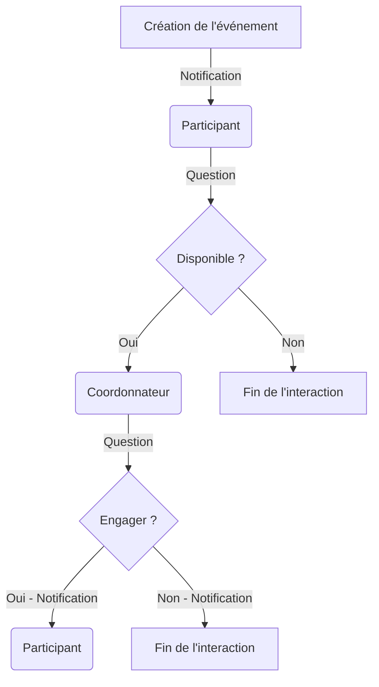
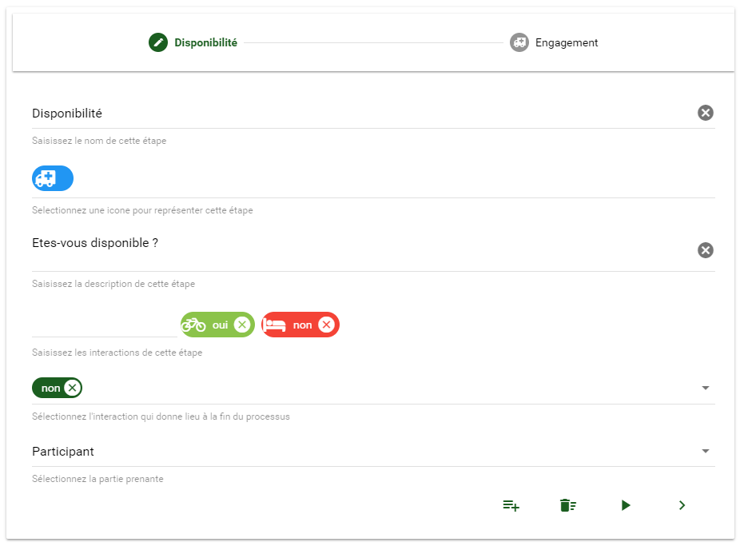
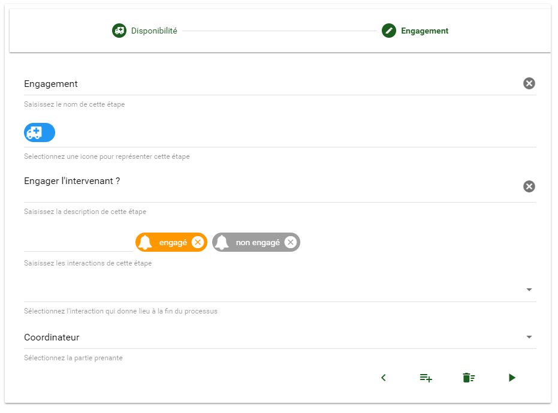
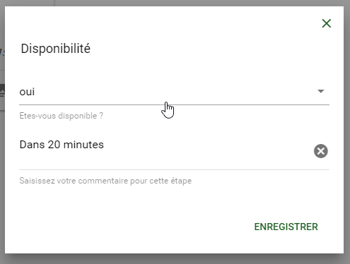
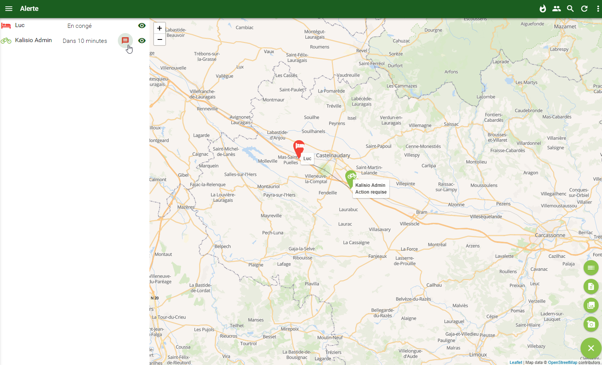

# Processus

Par défaut un modèle d'événement est un simple message informatif sans possibilité d’interaction entre les participants et les coordonnateurs.

L'ajout d'un **processus** permet de définir une *séquence d'interactions* (i.e. questions à choix multiples) auxquelles doivent répondre le participant et/ou le coordonnateur de l'événement.

Un processus en deux étapes pourrait être celui-ci:
  1. interaction du participant attendue: *êtes-vous disponible ou indisponible pour intervenir sur cet événement ?*
  2. réponse du coordonnateur attendue: *je vous engage ou je ne vous engage pas sur cet événement*

::: tip Astuce
Chaque réponse du coordonnateur à la question d'une étape du processus engendre la génération d'une notification vers le participant destinataire.
:::

## Définition

En pratique, un éditeur dédié permet de définir chaque étape au sein de l'application, par exemple son titre et la question à laquelle les intervenants devront répondre. Pour notre exemple la configuration de la première étape ressemblerait à ceci:

Et celle de la seconde étape ressemblerait à ceci:

:point_right: Vous êtes gestionnaire d'une organisation ? <ClientOnly><tour-link text="Voir comment créer un modèle avec processus" path="home" :params="{ organisation: 'manager', route: 'create-event-template' }"/></ClientOnly>

## Exécution

Lors de la réception de l'événement par un intervenant, l'application lui demandera de choisir parmi les réponses possibles et le fera avancer à l'étape suivante du processus, ou stoppera ses interactions à ce niveau, suivant sa réponse. A chaque étape un commentaire libre optionnel peut permettre de fournir des informations supplémentaires:

Le coordonnateur dispose quant à lui d'une *vue cartographique* synthétisant la position des intervenants et leur état d'avancement selon l'icônographie définie dans le processus. En un clin d'oeil il visualise la liste des participants ayant reçu l'événement ainsi que leurs réponses. Il sait également qu'il doit engager une interaction avec ceux attendant une réponse de sa part conformément à la définition du processus grâce à une icône dédiée:

