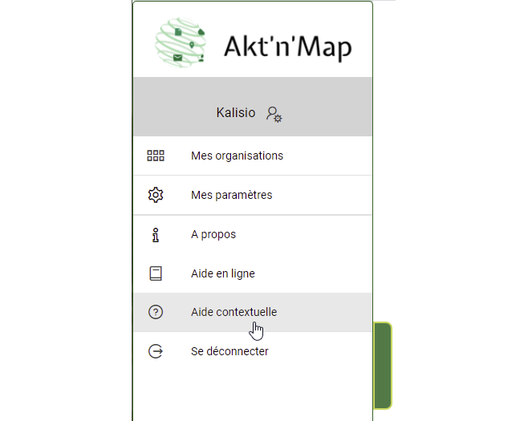
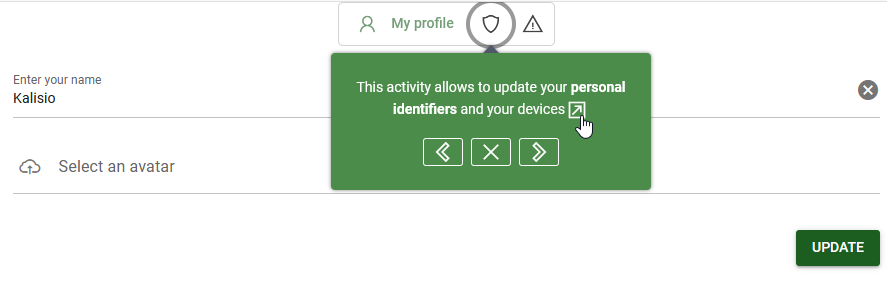
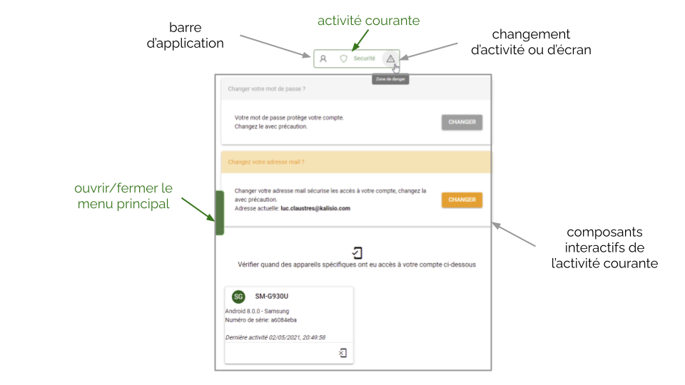
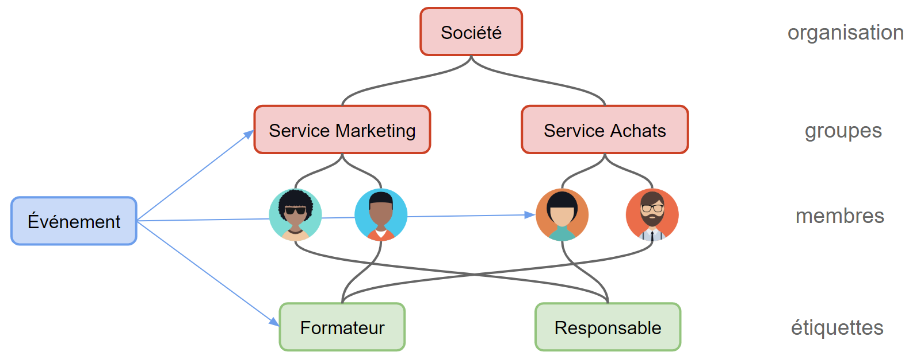

# Concepts de base

Nous allons illustrer ici les *concepts de base* vous permettant de prendre en main Kalisio Crisis.

Cette présentation s'accompagne parfois de petits *didacticiels* qui peuvent être exécutés directement sur l'application. Aussi il vous sera nécessaire de suivre tout d'abord les étapes vous permettant de créer un compte sur l'application puis de vous y connecter pour que cela fonctionne correctement.

Un lien peut vous permettre d'exécuter directement un didacticiel depuis la documentation, sinon rendez-vous sur l'application à l'endroit adéquat puis activez le didacticiel en cliquant sur l'icone <a href=""><i class="las la-question-circle"/></a> dans le menu principal.

::: tip Astuce
Pour ouvrir le menu principal utilisez la poignée apparaissant sur le côté gauche de l'écran.
:::

Vous pourrez ensuite suivre les instructions pas à pas <a href=""><i class="las la-chevron-right"/></a> (ou touche <i class="las la-arrow-right"/> du clavier) ou revenir en arrière <a href=""><i class="las la-chevron-left"/></a> (ou touche <i class="las la-arrow-left"/> du clavier) et stopper à tout instant <a href=""><i class="las la-times"/></a> (ou touche *echap* du clavier) comme illustré sur la figure suivante:

::: tip Astuce
Lorsque vous voyez un label *beta* sur un élément de l'interface utilisateur (par exemple sur un bouton), cela signifie que la fonctionnalité est actuellement en *bêta test*. C'est à dire qu'il s'agit d'une première version et qu'en vue de son amélioration nous recueillons les commentaires et suggestions de nos utilisateurs.
:::

::: warning Attention
Kalisio Crisis s'améliore et évolue de façon continue. Aussi, ce qui s’affiche sur votre écran peut parfois différer de ce que vous lirez et verrez dans cette documentation, mais les concepts clés restent les mêmes.
:::

## Activité

Au sein de l'application les actions visant à réaliser une tâche spécifique, comme la gestion des [membres](./concepts.md#role) de son [organisation](./concepts.md#organisation) ou de son [catalogue cartographique](../gofurther/catalog.md), sont regroupées sur un même écran présentant une interface utilisateur adaptée et nommée **activité**. Lorsque plusieurs écrans sont nécessaires compte tenu du nombre d'actions possibles, ils sont affichés sous la forme d'**onglets**. La sélection d'un onglet permet de basculer sur l'écran ad-hoc.

Par exemple, tout ce qui a trait à votre compte et à sa sécurité est centralisé dans une activité de gestion composée de trois écrans comme illustré sur la figure suivante:

Depuis une activité vous pouvez à tout moment ouvrir le <ClientOnly><tour-link text="menu principal" path="home" :params="{ tour: 'home' }"/></ClientOnly> sur la gauche de l'écran ou basculer sur d'autres activité via la **barre d'application** en haut de l'écran.

## <i class="las la-user"></i> Utilisateur

Une *personne* qui est **enregistrée** sur Kalisio Crisis. Cela peut se faire de deux manières:
  * soit en créant elle-même son **compte** sur l'application,
  * soit en étant *invitée* au sein d'une organisation par un autre utilisateur de l'application.

:point_right: Vous n'avez pas encore de compte et souhaitez en créer un ? <ClientOnly><tour-link text="Voir comment créer son compte" path="register"/></ClientOnly>

:point_right: Vous avez créé votre compte et ne parvenez pas à vous connecter ? <ClientOnly><tour-link text="Voir comment se connecter" path="login"/></ClientOnly>

:point_right: Vous avez créé votre compte et êtes parvenu à vous connecter ? <ClientOnly><tour-link text="Parcourir le menu principal" path="home" :params="{ tour: 'home' }"/></ClientOnly>

::: details Voir aussi
<ClientOnly><tour-link text="Voir comment inviter des membres" path="home" :params="{ organisation: 'manager', route: 'add-member' }" /></ClientOnly> lorsque vous avez créé une organisation et souhaitez inviter des utilisateurs à collaborer.
:::

## <i class="las la-user-friends"></i> Organisation

Un *espace partagé* par plusieurs utilisateurs au sein duquel vous pouvez inviter des personnes à collaborer, notamment pour gérer des **évènements**. Un utilisateur peut appartenir à *plusieurs* organisations et peut également **créer** de nouvelles organisations.

Un *tableau de bord* synthétise les événements en cours au sein de ses différentes organisations sur la page d'acceuil. Toutes les activités relatives à la configuration des organisations sont également accessibles depuis ce tableau de bord. En sélectionnant une activité cible sur une organisation vous en faite votre *contexte* ou espace de travail courant. 

Voir comment entrer dans le contexte d'une organisation ou en créer une nouvelle via le <ClientOnly><tour-link text="tableau de bord" path="home/organisations"/></ClientOnly>

::: tip Astuce
Lorsque vous n'appartennez qu'à une seule organisation vous rentrerez directement dans son contexte lors de la connexion.
:::

::: details Voir aussi
Comment afficher le tableau de bord depuis le <ClientOnly><tour-link text="menu principal" path="home" :params="{ tour: 'home' }"/></ClientOnly>
:::

Selon les organisations, un utilisateur possède des *rôles différents* et ne dispose donc pas des même fonctionnalités. La figure suivante illustre un exemple où:
* un utilisateur appartient à plusieurs organisations (1, 2 et 3),
* un utilisateur gère plusieurs organisations (2),
* une organisation possède plusieurs groupes (3),
* un membre d'une organisation appartient à plusieurs groupes (3).

### <i class="las la-graduation-cap"></i> Rôle

Un **rôle** défini les droits d'un utilisateur au sein d'une organisation ou d'un groupe:
  * en tant que <i class="las la-user"></i> *membre* il ne peut pas modifier l'état de l'organisation ou du groupe (droit de consultation),
  * en tant que <i class="las la-briefcase"></i> *gestionnaire* il peut modifier l'état de l'organisation ou du groupe (droit d'édition),
  * en tant que <i class="las la-certificate"></i> *propriétaire* il peut supprimer l'organisation ou le groupe (contrôle total).

::: tip Astuce
Les droits sont cumulatifs, c'est à dire qu'un propriétaire (respectivement gestionnaire) possède tous les droits d'un gestionnaire (respectivement membre).
:::

Le gestionnaire d'une organisation peut donc:
  * gérer les **membres** au sein de cette organisation (ajout, suppression),
  * gérer les **groupes** au sein de cette organisation (création, mise à jour, ajout et suppression des membres, destruction).

Le propriétaire peut également détruire l'organisation et gérer les moyens de paiements.

Le gestionnaire d'un groupe peut gérer les **membres** au sein de ce groupe.

::: tip Astuce
L'utilisateur qui créé une organisation en est par défaut le propriétaire mais il peut partager ou déléguer la gestion à d'autres.
:::

### <i class="las la-sitemap"></i> Groupe

Un **groupe** vous permet de *déléguer* la gestion d'un espace de travail restreint à ses membres. Les utilisateurs en dehors du groupe ne pourrons pas interagir avec lui.

:point_right: Vous êtes gestionnaire d'une organisation ? <ClientOnly><tour-link text="Voir comment gérer vos groupes" path="home" :params="{ organisation: 'manager', route: 'groups-activity' }"/></ClientOnly>

:point_right: Vous avez créé un groupe ? <ClientOnly><tour-link text="Voir comment ajouter des membres à votre groupe" path="home" :params="{ organisation: 'manager', route: 'members-activity' }"/></ClientOnly>

::: details Voir aussi
Comment entrer dans l'activité de gestion des groupes depuis le <ClientOnly><tour-link text="tableau de bord" path="home/organisations"/></ClientOnly>

Comment afficher le tableau de bord depuis le <ClientOnly><tour-link text="menu principal" path="home" :params="{ tour: 'home' }"/></ClientOnly>
:::

### <i class="las la-tags"></i> Etiquette

Une **étiquette** vous permet de *catégoriser* un sous-ensemble des membres de votre organisation selon un *critère métier* (e.g. une compétence ou un service).

Une étiquette est *transverse* à votre organisation, c'est à dire qu'avec elle vous pouvez cibler des personnes ayant les même critères métier au sein de différents groupes.

:point_right: Vous êtes gestionnaire d'une organisation ? <ClientOnly><tour-link text="Voir comment gérer vos étiquettes" path="home" :params="{ organisation: 'manager', route: 'tags-activity' }"/></ClientOnly>

:point_right: Vous souhaitez étiquetter des membres ? <ClientOnly><tour-link text="Voir comment étiquetter des membres" path="home" :params="{ organisation: 'manager', route: 'members-activity' }"/></ClientOnly>

::: details Voir aussi
Comment entrer dans l'activité de gestion des étiquettes depuis le <ClientOnly><tour-link text="tableau de bord" path="home/organisations"/></ClientOnly>

Comment afficher le tableau de bord depuis le <ClientOnly><tour-link text="menu principal" path="home" :params="{ tour: 'home' }"/></ClientOnly>
:::

## <i class="las la-fire"></i> Evénement

Une *chose à faire* ou une *information autour d'un fait concret* que l'on désire partager et traiter avec certains membres d'une organisation. Typiquement une information opérationnelle, une intervention sur le terrain, des actions de gestion de crise, etc.

Un événement génère des *notifications* sur les mobiles des **participants** qui ont installé l'application mobile lors de sa création. Il est mis à jour et clôturé par ses **coordonnateurs**.

Les participants et les coordonnateurs d'un événement peuvent être choisis comme:
  * des membres de façon individuelle,
  * des groupes,
  * des étiquettes.

::: tip Astuce
L'utilisateur qui créé un événement en est par défaut le coordonnateur mais il peut partager ou déléguer la gestion à d'autres.
:::

La figure suivante résume un exemple de structuration classique dans l'application et comment un événement peut cibler des personnes à différents niveaux:

A un évènement, Kalisio Crisis permet d’associer :
  * une *localisation* (adresse ou coordonnées géographiques),
  * des *photos* ou des *documents* afin de les partager entre les acteurs,
  * un ***[processus](../gofurther/workflow.md)*** définissant les interaction entre les participants et les coordonnateurs.

:point_right: Vous êtes prêt à partager de l'information ? <ClientOnly><tour-link text="Voir comment gérer vos événements" path="home" :params="{ organisation: 'member', route: 'events-activity' }"/></ClientOnly>

::: tip Astuce
Gagnez du temps en localisant votre événement directement depuis votre [catalogue cartographique](../gofurther/catalog.md).
:::

### Modèle d'événement

Un événement s'initie toujours à partir d'un **modèle** qui définit son contenu de base. Dans chaque modèle un titre, une description, et/ou des destinataires par défaut pourront être définis. Ainsi, lors de la création de l'événement, il ne reste qu'à compléter ou amender certains éléments au besoin tels que la localisation.

::: tip Astuce
Généralement les modèles suivent une *typologie* métier. Par exemple des sapeurs-pompiers pourront définir un modèle *Feu de forêt*, *Secours à personne* ou encore *Accident voie publique*.

Grâce à une typologie vous pourrez ensuite réaliser des **[statistiques pertinentes](../gofurther/archiving.md)** sur vos événements.
:::

:point_right: Vous êtes gestionnaire d'une organisation ? <ClientOnly><tour-link text="Voir comment gérer vos modèles" path="home" :params="{ organisation: 'manager', route: 'event-templates-activity' }"/></ClientOnly>

::: details Voir aussi
Comment entrer dans l'activité de gestion des modèles depuis le <ClientOnly><tour-link text="tableau de bord" path="home/organisations"/></ClientOnly>

Comment afficher le tableau de bord depuis le <ClientOnly><tour-link text="menu principal" path="home" :params="{ tour: 'home' }"/></ClientOnly>
:::

### Participant

Un participant ne peut pas modifier un événement bien qu'il puisse partager des documents ou des photos au sein de celui-ci.

### Coordonnateur

Un coordonnateur peut modifier et clôturer (i.e. détruire) un événement, ainsi que sa liste de participants ou coordonnateurs.

Il a également accès à une *vue cartographique* synthétisant la position des acteurs et leur état d’avancement dans le [processus](../gofurther/workflow.md).

## Abonnements

Chaque organisation dispose d'un **abonnement de base** définissant les limites de ressources pour ses membres au sein de l'application.

Bien que vous puissiez utiliser l'application gratuitement à des fins de test ou pour un usage privé (abonnement **bronze**), le nombre de modèles d'événement, de groupes ou de membres est limité par défaut. Si vous avez besoin d'intégrer plus de personnes au sein de votre organisation, ou de disposer de plus de modèles, vous pouvez souscrire à tout moment un abonnement plus adapté à vos besoins (**argent**, **or** ou **diamant**).

De plus, si l'activité de votre association ou entreprise requiert l'utilisation de certaines de nos [fonctionnalités avancées](../gofurther/README.md) vous devez souscrire un ou plusieurs **abonnements additionels** pour les rendre disponibles à vos membres.

::: warning Note
:point_right: Vous êtes propriétaire d'une organisation ? <ClientOnly><tour-link text="Voir les abonnements disponibles et comment souscrire" path="home" :params="{ organisation: 'owner', route: 'edit-organisation-billing' }"/></ClientOnly>
:::
