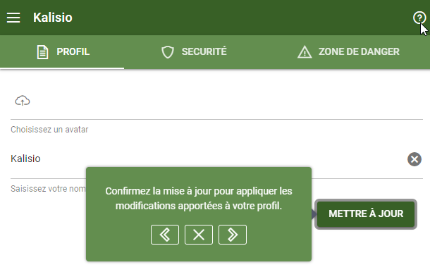
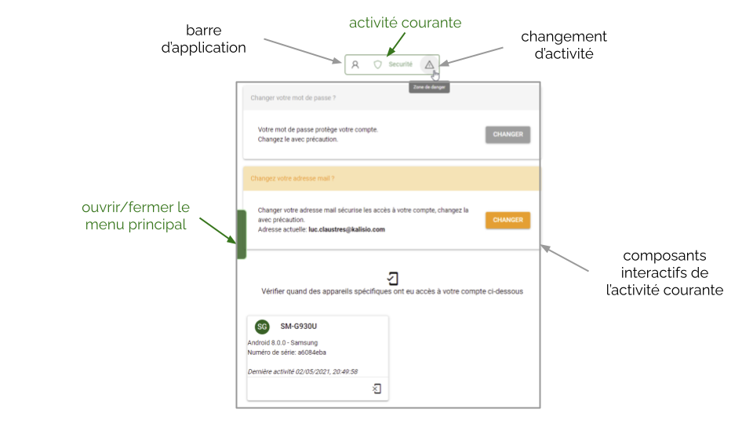
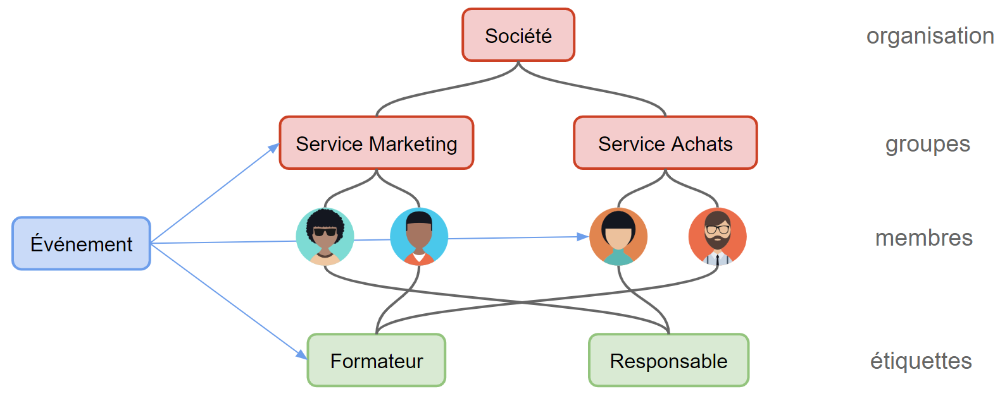

# Concepts de base

Nous allons illustrer ici les *concepts de base* vous permettant de prendre en main Akt'n'Map.

Cette présentation s'accompagne parfois de petits *didacticiels* qui peuvent être exécutés directement sur l'application. Aussi il vous sera nécessaire de suivre tout d'abord les étapes vous permettant de créer un compte sur l'application puis de vous y connecter pour que cela fonctionne correctment.

Un lien peut vous permettre d'exécuter directement un didacticiel depuis la documentation, sinon rendez-vous sur l'application à l'endroit adéquat puis activez le didacticiel en cliquant sur l'icone <a href=""><i class="las la-question-circle"/></a>. Vous pourrez ensuite suivre les instructions pas à pas <a href=""><i class="las la-chevron-left"/></a> ou revenir en arrière <a href=""><i class="las la-chevron-right"/></a> et stopper à tout instant <a href=""><i class="las la-times"/></a> comme illustré sur la figure suivante:

::: warning Attention
Akt'n'Map s'améliore et évolue de façon continue. Aussi, ce qui s’affiche sur votre écran peut parfois diffèrer de ce que vous lirez et verrez dans cette documentation, mais les concepts clés restent les mêmes.
:::

## <i class="las la-user"></i> Utilisateur

Une *personne* qui est **enregistrée** sur Akt'n'Map. Cela peut se faire de deux manières:
  * soit en créant elle-même son **compte** sur l'application,
  * soit en étant *invitée* au sein d'une organisation par un autre utilisateur de l'application.

:point_right: Vous n'avez pas encore de compte et souhaitez en créer un ? <tour-link text="Voir comment créer son compte" path="register"/>

:point_right: Vous avez créé votre compte et ne parvenez pas à vous connecter ? <tour-link text="Voir comment se connecter" path="login"/>

:point_right: Vous avez créé votre compte et êtes parvenu à vous connecter ? <tour-link text="Parcourir le menu principal" path="home" :params="{ tour: 'home' }"/>

## Activité

Au sein de l'application les actions visant un même type d'objets sont regroupés sur un même écran présentant une interface utilisateur adaptée et nommée **activité**. Lorsque plusieurs écrans sont nécessaires compte tenu du nombre d'actions possibles ils sont affichés sous la forme d'**onglets**. La sélection d'un onglet permet de basculer sur l'écran ad-hoc.

Par exemple, tout ce qui a trait à votre compte et à sa sécurité est centralisé dans une activité de gestion composée de trois écrans comme illustré sur la figure suivante:

## <i class="las la-user-friends"></i> Organisation

Un *espace partagé* par plusieurs utilisateurs au sein duquel vous pouvez inviter des personnes à collaborer, notamment pour gérer des **évènements**. Avant de pouvoir réaliser certaines actions dans une organisation il faut tout d'abord la sélectionner pour en faire votre *contexte* ou espace de travail courant. 

Voir comment entrer dans le contexte d'une organisation via le <tour-link text="menu principal" path="home" :params="{ tour: 'home' }"/>

Un utilisateur peut appartenir à *plusieurs* organisations. Dans ce cas un *tableau de bord* synthétise les événements en cours au sein de ses différentes organisations sur la page d'acceuil.

:point_right: Vous appartenez à *plusieurs* organisations ? <tour-link text="Voir votre tableau de bord" path="home/dashboard"/>

Un utilisateur peut également créer de nouvelles organisations.

:point_right: Vous souhaitez créer une nouvelle organisation ? <tour-link text="Voir comment faire via le menu principal" path="home" :params="{ tour: 'home' }"/>

Selon les organisations, un utilisateur possède des *rôles différents* et ne dispose donc pas des même fonctionnalités. La figure suivante illustre un exemple où:
* un utilisateur appartient à plusieurs organisations (1, 2 et 3),
* un utilisateur gére plusieurs organisations (2),
* une organisation possède plusieurs groupes (3),
* un membre d'une organisation appartenient à plusieurs groupes (3).

### <i class="las la-graduation-cap"></i> Rôle

Un **rôle** défini les droits d'un utilisateur au sein d'une organisation ou d'un groupe:
  * en tant que <i class="las la-user"></i> *membre* il ne peut modifier l'état de l'organisation ou du groupe (droit de consultation),
  * en tant que <i class="las la-briefcase"></i> *gestionnaire* il peut modifier l'état de l'organisation ou du groupe (droit d'édition),
  * en tant que <i class="las la-certificate"></i> *propriétaire* il peut supprimer l'organisation ou le groupe (contrôle total).

::: tip Astuce
Les droits sont cumulatifs, c'est à dire qu'un propriétaire (respectivement gestionnaire) possède tous les droits d'un gestionnaire (respectivement membre).
:::

Le gestionnaire d'une organisation peut donc:
  * gérer les **membres** au sein de cette organisation,
  * créer des **groupes** au sein de cette organisation.
Le propriétaire peut également détruire l'organisation et gérer les moyens de paiements.

Le gestionnaire d'un groupe peut gérer les **membres** au sein de ce groupe et le modifier. Le propriétaire peut également détruire le groupe.

::: tip Astuce
L'utilisateur qui créé une organisation ou un groupe en est par défaut le propriétaire mais il peut partager ou déléguer la gestion à d'autres.
:::

### <i class="las la-sitemap"></i> Groupe

Un **groupe** vous permet de *déléguer* la gestion d'un espace de travail restreint à ses membres. Les utilisateurs en dehors du groupe ne pourrons pas y accéder ni voir ses membres.

:point_right: Vous êtes gestionnaire d'une organisation ? <tour-link text="Voir comment gérer vos groupes" path="home" :params="{ organisation: 'manager', route: 'groups-activity' }"/>

::: details Voir aussi
Comment entrer dans le contexte d'une organisation via le <tour-link text="menu principal" path="home" :params="{ tour: 'home' }"/>

Comment entrer dans l'activité de gestion des groupes depuis <tour-link text="le contexte de l'organisation" path="home" :params="{ organisation: 'manager', tour: 'context' }"/>
:::

### <i class="las la-tags"></i> Etiquette

Une **étiquette** vous permet de *catégoriser* un sous-ensemble des membres de votre organisation selon un *critère métier* (e.g. une compétence ou un service).

Une étiquette est *transverse* à votre organisation, c'est à dire qu'avec elle vous pouvez cibler des personnes ayant les même critères métier au sein de différents groupes.

:point_right: Vous êtes gestionnaire d'une organisation ? <tour-link text="Voir comment gérer vos étiquettes" path="home" :params="{ organisation: 'manager', route: 'tags-activity' }"/>

::: details Voir aussi
Comment entrer dans le contexte d'une organisation via le <tour-link text="menu principal" path="home" :params="{ tour: 'home' }"/>

Comment entrer dans l'activité de gestion des étiquettes depuis <tour-link text="le contexte de l'organisation" path="home" :params="{ organisation: 'manager', tour: 'context' }"/>
:::

## <i class="las la-fire"></i> Evénement

Une *chose à faire* ou une *information autour d'un fait concret* que l'on désire partager et traiter avec certains membres d'une organisation. Typiquement une information opérationnelle, une intervention sur le terrain, des actions de gestion de crise, etc.

Un événement génère des *notifications* sur les mobiles des **participants** qui ont installé lapplication mobile lors de sa création, mise à jour et clôture par ses **coordinateurs**.

Les participants et les coordinateurs d'un événement peuvent être choisis comme:
  * des membres de façon individuelle,
  * des groupes,
  * des étiquettes.

::: tip Astuce
L'utilisateur qui créé un événement en est par défaut le coordinateur mais il peut partager ou déléguer la gestion à d'autres.
:::

La figure suivante résume un exemple de structuration classique dans l'application et comment un événement peut cibler des personnes à différents niveaux:

A un évènement, Akt'n'Map permet d’associer :
  * des *photos* ou des *documents* afin de les partager entre les acteurs,
  * un **[processus](../gofurther/workflow.md)** définissant les interaction entre les participants et les coordinateurs.

:point_right: Vous êtes prêt à partager de l'information ? <tour-link text="Voir comment gérer vos événements" path="home" :params="{ organisation: 'member' }"/>

### Modèle d'événement

Un événement s'initie toujours à partir d'un **modèle** qui définit son contenu de base. Dans chaque modèle un titre, une description, et/ou des destinataires par défaut pourront être définis. Ainsi, lors de la création de l'événement, il ne reste qu'à compléter ou amender certains éléments au besoin tels que le la localisation.

::: tip Astuce
Généralement les modèles suivent une *typologie* métier. Par exemple des sapeurs-pompiers pourront définir un modèle *Feu de forêt*, *Secours à personne* ou encore *Accident voie publique*.

Grâce à une typologie vous pourrez ensuite réaliser des **[statistiques pertinentes](../gofurther/archiving.md)** sur vos événements.
:::

:point_right: Vous êtes gestionnaire d'une organisation ? <tour-link text="Voir comment gérer vos modèles" path="home" :params="{ organisation: 'manager', route: 'event-templates-activity' }"/>

::: details Voir aussi
Comment entrer dans le contexte d'une organisation via le <tour-link text="menu principal" path="home" :params="{ tour: 'home' }"/>

Comment entrer dans l'activité de gestion des modèles depuis <tour-link text="le contexte de l'organisation" path="home" :params="{ organisation: 'manager', tour: 'context' }"/>
:::

### Participant

Un participant ne peut pas modifier un événement bien qu'il puisse partager des documents ou des photos au sein de celui-ci.

### Coordinateur

Un coordinateur peut modifier et clôturer (i.e. détruire) un événement, ainsi que sa liste de participants ou coordinateurs.

Il a également accès à une *vue cartographique* synthétisant la position des acteurs et leur état d’avancement dans le [processus](../gofurther/workflow.md).