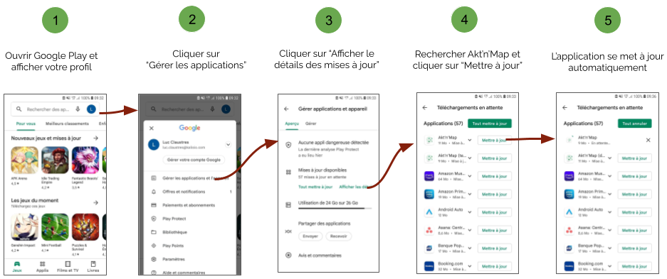

# Mise à jour

## Application internet

L'application internet ne nécessite aucune procédure de mise à jour particulière. Lorque nous mettons à jour nos services cela est fait de façon automatique.

## Applications mobiles

En général les applications que vous téléchargez sont automatiquement mises à jour. Néanmoins, dans certains cas (configuration spécifique de votre appareil, absence de réseau Wi-Fi, etc.), la mise à jour ne peut s'effectuer de façon automatique, vous devez alors procéder à la mise à jour manuellement.

::: warning Information
Lorque nous mettons à jour nos services votre application mobile peut afficher un message indiquant une discordance de version avec nos services en ligne, c'est qu'il est temps de la mettre à jour !
:::

### Android

Lorsqu'une nouvelle version est disponible vous pouvez la mettre à jour en suivant cette procédure:

### iOS

Lorsqu'une nouvelle version est disponible vous pouvez la mettre à jour en suivant cette procédure:
1. Ouvrez l'App Store, puis sélectionnez *"Aujourd'hui"* en bas de l’écran.
2. Touchez l'icône de votre profil en haut de l'écran.
3. Faites défiler l'écran pour trouver Akt'n'Map puis sélectionnez l'option *"Mettre à jour"* qui figure à côté.