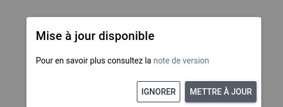

# Mise à jour

L'application internet ne nécessite aucune procédure de mise à jour particulière. Lorsque nous mettons à jour nos services une fenêtre contextuelle apparaîtra pour mettre à jour l'application.

