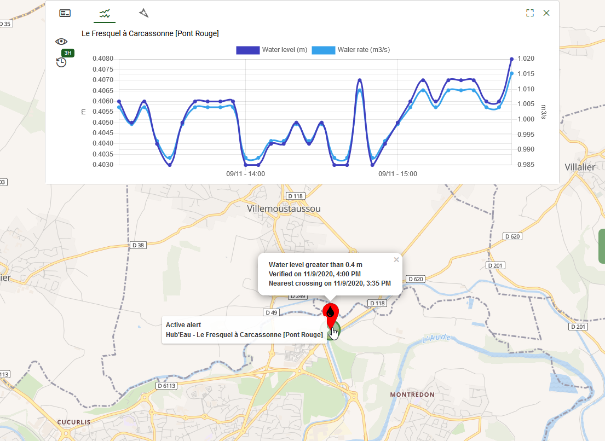

# <i class="las la-bell"></i> Environmental alerts

**Environmental alert** automatically generates an [event](../quickstart/concepts.md#event) whenever specific conditions are met within your region in our environmental data. Typically it can be:
* dangerous meteorological conditions to identify like a wind speed greater than 100 Km/h in a given area,
* reference levels/thresholds to be checked like a 100 year flood level on a river.

Alerts ensure smooth and reliable day-to-day vigilance operations and warn your team in a matter of seconds.

::: warning Note
This feature requires a subscription to the [environmental data catalog](./catalog.md), it will not be available otherwise.
:::

## Create an alert

Alerts can be created from the [mapping catalog](./catalog.md) by selecting the target data layer in the [catalog panel](./catalog.md#catalog-panel). Select a [weather forecast](./catalog.md#weather-prediction) like wind or sensor networks like [Hub'Eau](./catalog.md#hub-eau).

Right click at the location where you want to check your conditions on the map for weather forecast data. The action allowing to create an alert <i class="las la-bell"></i> appear in the [contextual menu](./catalog.md#contextual-menu). Similarly, make it appear by right clicking on the sensor you would like to check your conditions on for measurements. The component to define the settings of your alert is divided into different sections:
  
<i class="las la-clock la-2x"></i> The frequency to check your alert conditions as well as the analysis time range. For sensor data it will be the range where to seek for triggers in the past. For weather forecast data it will be the time range where to seek for triggers in the future.

<i class="lab la-cloudversify la-2x"></i> Conditions triggering the alert given as thresholds to (or to not) overcome for each available meteorological element or measure value.

<i class="las la-bell la-2x"></i> The template of the event to be created when triggering the alert and if it has to be automatically closed when the alert becomes inactive.

::: warning Note
As the event is automatically created by the application once the alert conditions are met, it should at least contain one participant and one coordinator.
:::

