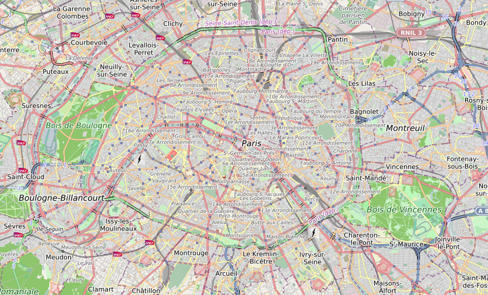

# Mapping catalog

The catalog activity allows to visualise and interact with data on a digital map. Driven by today's most advanced web technologies, it enables tracking of geospatial assets in real-time.

::: warning Note
This feature requires a specific subscription, it will not be available otherwise.

:point_right: You own an organisation ? <tour-link text="How to subscribe" path="home" :params="{ organisation: 'owner', route: 'organisation-settings-activity', perspective: 'billing' }"/>
:::

## Key concepts

Here is a quick rundown of the *key concepts* to handle when you're just getting started with mapping.

The map can contain a **basemap** (i.e. a background context), a set of data **layers** (i.e. business specific data), and has an **extent** (i.e. the part of the Earth currently on the screen), and navigation tools to pan and zoom. A layer specifies how a geographic dataset is portrayed on the map. The final rendering supporting your use case can usually be assembled by adding a serie of layers.

A **feature layer** is a grouping of similar geographic elements, for example, buildings, cities, roads, earthquake epicenters, etc. Features can be points, lines, or polygons (areas). Feature layers are most appropriate for visualizing your own data on top of your basemaps. Using the catalog activity you can view, save, edit and analyze your own features and their attributes. Moreover, you can include interactive pop-up windows with information about the features.

The activity manages both **space** and **time** information in order to visualize *time-varying* geospatial phenomena: tracking of moving objects, history of measures taken by a sensor, weather prediction over time, etc. When a layer displays a time-varying dataset you are able to navigate back and forward in time using a **timeline** to see the data at your requested date/time.

## Data

The catalog comes with a set of built-in geospatial data. However, you can complete it with your own spatial data.

### OpenStreetMap

[OpenStreetMap](https://www.openstreetmap.org/) is a collaborative project to create a free editable map of the world. 

This [vector](https://datacarpentry.org/organization-geospatial/02-intro-vector-data/index.html) data is structured according different categories (buildings, landuse, etc.). They are available in different styles (e.g. bright, dark, topography). Data is generated by [OpenMapTiles](https://openmaptiles.com/).

### Vigicrues

Flood warnings from the [Vigicrues](https://www.vigicrues.gouv.fr/) service.

### Hub'Eau

Hydrometric data from the [Hub'Eau](https://hubeau.eaufrance.fr/) portal.

### Téléray

Ambient radioactivity measures from the [Réseau national de télémesure Téléray](https://www.irsn.fr/FR/connaissances/Environnement/surveillance-environnement/organisation/reseaux-surveillance/Pages/1-reseaux-telesurveillance.aspx#.XyM9qJ77QuU). 

### OpenAQ

Air quality data collected in 93 different countries by the [OpenAQ](https://openaq.org/) non-profit organization. It aggregates PM2.5, PM10, ozone (O3), sulfur dioxide (SO2), nitrogen dioxide (NO2), carbon monoxide (CO), and black carbon (BC) from real-time government and research grade sources. 

### Mapillary

Crowdsourced geotagged photos database from [Mapillary](https://www.mapillary.com/) platform.

### GSMaP

Global Precipitation Measurement (GPM) is a joint mission between different space agencies to make observations of Earth's precipitations.

### Weather prediction

Available meteorological elements are the following:
* wind speed (m/s) and direction (°) at 10m,
* gust at 2m (m/s),
* temperature at 2m (°C),
* cumulated ground precipitations (rain and snow) over 3h (mm/h).

Data are gathered from different numerical weather prediction models detailed hereafter.

ARPEGE (Action de Recherche Petite Echelle Grande Echelle), which is an essential tool for operational weather forecasting at Météo France. Four daily forecasts are made at 0, 6, 12 and 18h UTC, with forecasting time of 102h, 72h, 114h and 60h respectively. Model forecasts are interpolated on a regular lat/lon grids, with one 0.1°x0.1° grid over the Europe-Atlantic domain and one 0.25°x0.25° grid over the Earth.

AROME, operational at Météo-France since December 2008, which was designed to improve short range forecasts of severe events such as intense Mediterranean precipitations (Cévenole events), severe storms, fog, urban heat during heat waves. Five daily forecasts are made with AROME, thus helping to better predict meteorological events of the day and of the morrow (42h forecast range). The size of the mesh, many time smaller than previous models, is 1.3km against 7.5km for ARPEGE over France.

Global Forecast System (GFS) is a weather forecast model produced by the National Centers for Environmental Prediction (NCEP), are also available. The entire globe is covered by the GFS at a base horizontal resolution of 18 miles (28 kilometers) between grid points, which is used by the operational forecasters who predict weather out to 16 days in the future.

## Components

Each component can be shown/hidden through a handle on the different side of the view:
* at the top to open the **navigation bar**,
* at the bottom to open the **timeline**,
* on the right to open the **catalog panel**.

In addition, a **floating action button** <i class="las la-chevron-up la-2x"></i> is available in the bottom-right corner to perform some actions.

:point_right: You manage an organisation ? <tour-link text="Browse the catalog activity components" path="home" :params="{ organisation: 'manager', route: 'catalog-activity', tourDelay: 2000 }"/>

::: details See also
How to enter into the context of an organisation through the <tour-link text="main menu" path="home" :params="{ tour: 'home' }"/>

How to enter the catalog activity from the <tour-link text="context of your organisation" path="home" :params="{ organisation: 'manager', tour: 'context' }"/>
:::

### Navigation bar

The navigation bar allows to quickly execute recurring actions:
* <i class="las la-crosshairs"></i> display the coordinates of a location,
* <i class="las la-search"></i> seek for an address,
* <i class="las la-street-view"></i> center the view on your current location,
* <i class="las la-expand"></i> switch to fullscreen mode.

:point_right: Launch the <tour-link text="activity tutorial" path="home" :params="{ organisation: 'manager', route: 'catalog-activity' }"/> then open the link <i class="las la-external-link-square-alt"/> to the navigation bar tutorial to get more details

### Catalog panel

The catalog panel allows to manage the layers displayed on your map. You can show/hide a layer by selecting it in the relevant category.

::: warning
The data of some layers are only visible starting from a given scale if there is too much data to ensure a readable and smvisualisation.

In this case the layer will be disable until you reach the required scale on the map (zoom in or zoom to the layer to do so).
:::

Using the menu <i class="las la-ellipsis-v"/> on a layer you can access [available actions](./catalog.md#layer-actions) for this layer.

:point_right: Launch the <tour-link text="activity tutorial" path="home" :params="{ organisation: 'manager', route: 'catalog-activity' }"/> then open the link <i class="las la-external-link-square-alt"/> to the catalog panel tutorial to get more details

### Timeline

The timeline allows to quickly execute actions related to the time of the displayed data. Stick to real-time or go forward (i.e. forecast)/backward (i.e. history) in time as you wish. 

:point_right: Launch the <tour-link text="activity tutorial" path="home" :params="{ organisation: 'manager', route: 'catalog-activity' }"/> then open the link <i class="las la-external-link-square-alt"/> to the timeline tutorial to get more details

### Floating action button

Using the FAB you can:
* <i class="las la-file-alt la-2x"/> Create a new blank data layer by locating and drawing the underlying entities. You can add the data schema from a [JSON schema](https://json-schema.org/) file in order to edit the meatadata (i.e. properties) of your entities.
* <i class="las la-file-alt"/> Create a new data layer by import existing data from a [GeoJSON](https://geojson.org/) file.
* <i class="las la-eye-dropper"/> Probe weather forecast data from active prediction models by selecting a specific location on the map.

:point_right: Launch the <tour-link text="activity tutorial" path="home" :params="{ organisation: 'manager', route: 'catalog-activity' }"/> then open the link <i class="las la-external-link-square-alt"/> to the FAB tutorial to get more details

### Contextual menu

A *right-click* on a feature of the map will display a contextual menu if some actions are available for the target element like <i class="las la-file-alt"/> editing the properties of a user-defined feature or <i class="las la-minus-circle"/> remove it.

If the target feature comes from a measure layer or you right-click on a location of the map after activating a weather data layer (e.g. wind) you can also <i class="las la-bell"/> [setup an alert](./alert.md).

### Layer actions

Depending on the layer different actions are available. The most common action is to *zoom to* <i class="las la-search-location"/> the layer in order to fit the view on the available data. If the layer is disabled at high scales this action will set the current scale of the map so that data will start be visible if the layer is shown.

More actions are available on user-defined feature layers:
* <i class="las la-save"></i> save the layer (i.e. make it persistent),
* <i class="las la-file-alt"></i> edit layer properties like its name or description,
* <i class="las la-edit"></i> edit layer features (metadata and geometry),
* <i class="las la-border-style"></i> edit display style,
* <i class="las la-filter"></i> filter data according to metadata,
* <i class="las la-th-list"></i> display raw data,
* <i class="las la-chart-pie"></i> create charts,
* <i class="las la-minus-circle"></i> delete the layer.