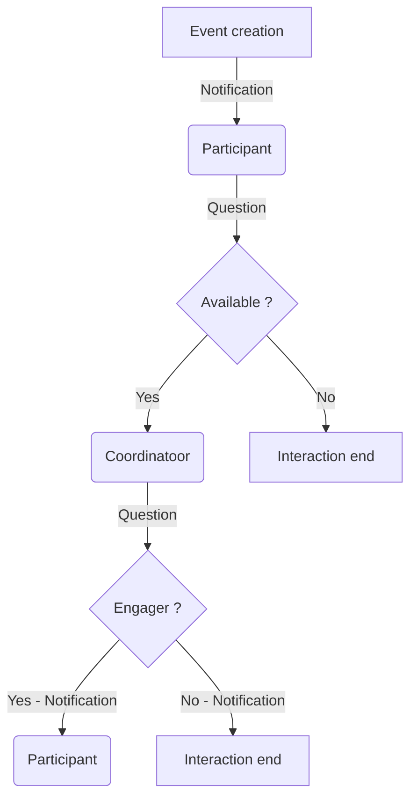
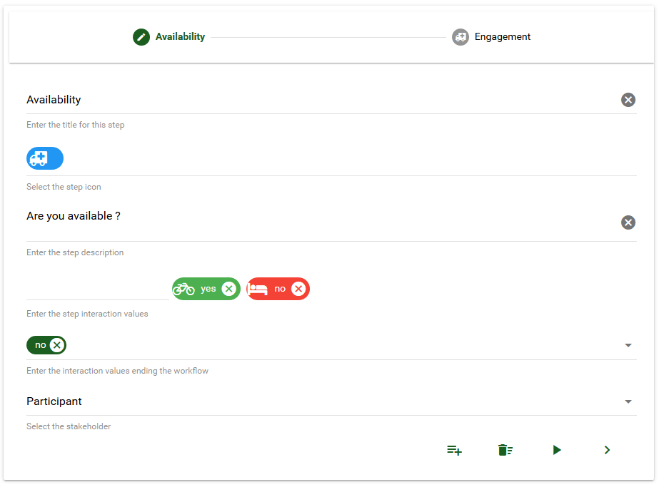
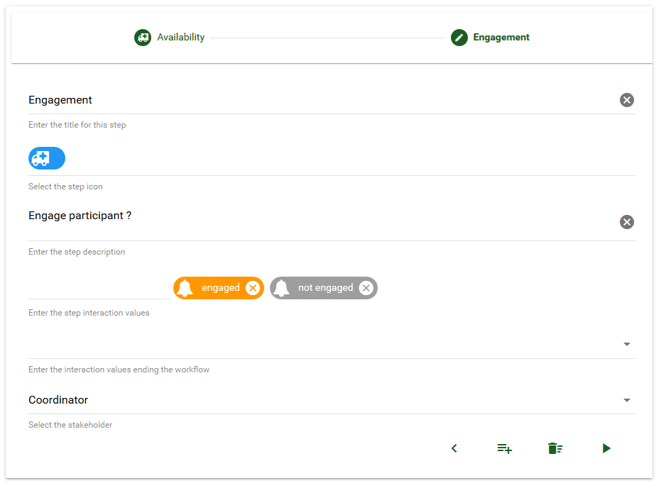
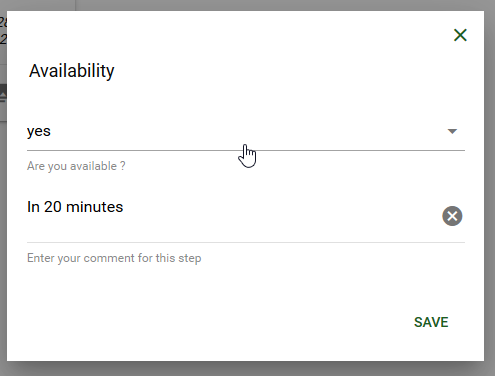
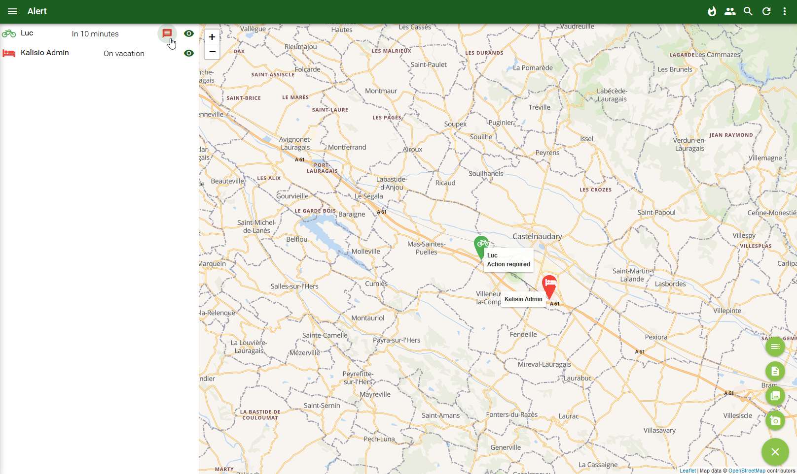

# Workflows

By default an event template is a simple information message without any interaction between participants and coordinators. 
By adding a workflow you can define a sequence of interactions (i.e. multiple-choice questions) that must be fulfilled by the participant and/or the coordinator of the event

Take the following workflow example composed of two steps:
  1. awaited participant interaction: *are available or not available to intervene on this event ?*
  2. awaited coordinator response: *you are engaged or you are not engaged on this event*

::: tip
Each answer of the coordinator to a question for a step of the process generates a notification toward the target participant.
:::

## Definition

Practically, a dedicated editor is used to define each workflow step in the application, i.e. its title and the question for participants. According to our example the first step will be the following:

According to our example the second step will be the following:

:point_right: You manage an organisation ? <ClientOnly><tour-link text="How to create a template including a workflow" path="home" :params="{ organisation: 'manager', route: 'create-event-template' }"/></ClientOnly>

## Execution

When receiving the event the application will ask the participant to anser the question and make him jump to the next step, or stop interacting at this stage, depending on his answer. For each step, a free comment allows to provide additional information required by your workflow:

The coordinator has access to a *cartographic view* summarizing the position and state of each participant according to the iconography defined within the process. At a glance he can see the list of participants who have received the event as well as their answers. He also knows if he has to provide an answer to some of them according to the definition of the workflow thanks to a specific icon:

