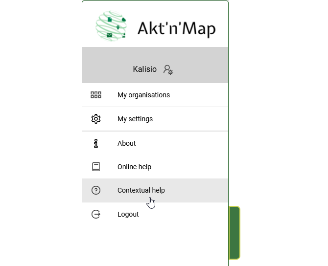
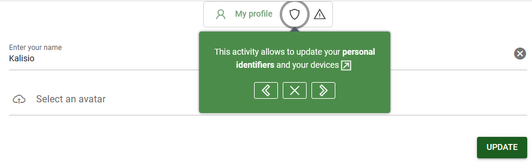
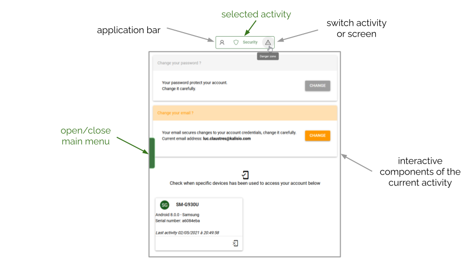
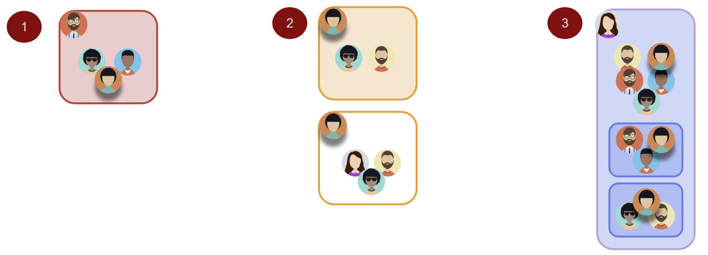
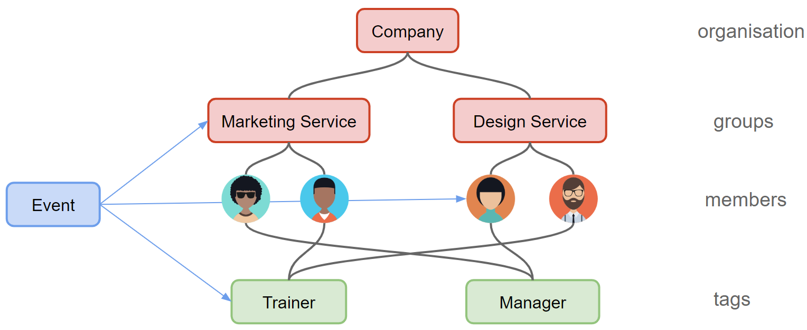

# Basics

Here is a quick rundown of the *key concepts* to handle when you're just getting started with Kalisio Crisis.

This presentation comes with small *tutorials* that can be directly run on the application. Thus, you will first have to follow the required steps to create your account then connect to make everything works as expected.

A link can allow you to execute the tutorial directly from the documentation, otherwise open the application at the right place then click on the following icon <a href=""><i class="las la-question-circle"/></a> in the main menu.

::: tip
To open the main menu use the handle on the left side of your screen.
:::

You can then follow the step by step guide <a href=""><i class="las la-chevron-right"/></a> (or <i class="las la-arrow-right"/> key), go back if required <a href=""><i class="las la-chevron-left"/></a> (or <i class="las la-arrow-left"/> key) and stop anytime <a href=""><i class="las la-times"/></a> (or *escape* key) as illustrated by the following figure:

::: tip
Sometimes you can see a *beta* label on a user interface element (like a button), meaning the feature is currently under *beta test*: in order to improve the first version of the feature we collect feedback from our users.
:::

::: warning
Kalisio Crisis look and features are ever-evolving. As a consequence, your screen probably looks a little different than what you can read and see in this documentation but the key concepts remain the same.
:::

## Activity

An **activity** is the entry point used in the application for interacting with the user on a given task like managing the [members](./concepts.md#role) of his [organisation](./concepts.md#organisation) or his [catalog](../gofurther/catalog.md). It usually represents a single screen with a dedicated user interface. When multiple screens are required due to the large number of possible actions, each one is displayed as a **tab**. Selecting a tab switch the user interface to the associated screen. 

For instance, what is related to your account and its security is managed in a specific account activity composed of three screens, as illustrated by the following figure:

From an activity you can always open the <ClientOnly><tour-link text="main menu" path="home" :params="{ tour: 'home' }"/></ClientOnly> on the left-side of the screen or switch to another activity using the **application bar** at the top of the screen.

## <i class="las la-user"></i> User

A *person* who has been **registered** to Kalisio Crisis. This can be done through two ways:
  * by creating his own **account** on the application,
  * by being *invited* within an organisation by another user of the application.

:point_right: Don't yet have an account and wish to create one ? <ClientOnly><tour-link text="How to create an account" path="register"/></ClientOnly>

:point_right: Already have an account but cannot connect ? <ClientOnly><tour-link text="How to connect" path="login"/></ClientOnly>

:point_right: You have created your account and successfully connect ? <ClientOnly><tour-link text="Browse the main menu" path="home" :params="{ tour: 'home' }"/></ClientOnly>

::: details See also
<ClientOnly><tour-link text="How to invite members" path="home" :params="{ organisation: 'manager', route: 'add-member' }" /></ClientOnly> when you have created your organisation and want to collaborate with users
:::

## <i class="las la-user-friends"></i> Organisation

A *shared workspace* between users where you can invite people to join and collaborate, notably to manage **events**. A user can belong to *multiple* organisations and can also **create** new organisations.

A *dashboard* summarizes the running events for all his organisations on the home page. All activities related to organisations management are also accessible from this dashboard. By selecting the target activity on an organisation you make it your current *context* or workspace.

:point_right: How to enter into the context of an organisation or create a new one through the <ClientOnly><tour-link text="dashboard" path="home/organisations"/></ClientOnly>

::: tip
If you belong to a single organisation you will automatically enter its context on login.
:::

::: details See also
How to display the dashboard from the <ClientOnly><tour-link text="main menu" path="home" :params="{ tour: 'home' }"/></ClientOnly>
:::

A user is being assigned *different roles* in his organisations so that different features are available depending on the currently selected organisation. The following figure shows a use case where:
* a user belongs to multiple organisations (1, 2 and 3),
* a user manages multiple organisations (2),
* an organisation has multiple groups (3),
* a member of an organisation belongs to multiple groups (3).

### <i class="las la-graduation-cap"></i> Role

A **role** assign you different *rights* inside an organisation or a group:
  * as a <i class="las la-user"></i> *member* you cannot update the organisation or the group (view right),
  * as a <i class="las la-briefcase"></i> *manager* you can also change the state of the organisation or the group (update right),
  * as a <i class="las la-certificate"></i> *owner* you can also delete the organisation or the group (full access).

::: tip
Rights are cumulative, a owner (respectively manager) owns all rights of a manager (respectively member).
:::

The manager of an organisation can:
  * manage **members** of this organisation (add, remove),
  * manage **groups** of this organisation (create, update, add or remove members, remove).
  
The owner can as well detroy the organisation and manage payment means.

The manager of a group can manage **members** of this group.

::: tip
By creating an organisation you become the owner by default but you can share this responsibility with others by assigning them new rights on this organisation.
:::

### <i class="las la-sitemap"></i> Group

A **group** allows to *delegate* the management of a shared workspace limited to its members. Users outside the group will not be able to interact with it.

:point_right: You manage an organisation ? <ClientOnly><tour-link text="How to manage your groups" path="home" :params="{ organisation: 'manager', route: 'groups-activity' }"/></ClientOnly>

:point_right: You have created a group ? <ClientOnly><tour-link text="How to add members to your group" path="home" :params="{ organisation: 'manager', route: 'members-activity' }"/></ClientOnly>

::: details See also
How to enter the groups management activity from the <ClientOnly><tour-link text="dashboard" path="home/organisations"/></ClientOnly>

How to display the dashboard from the <ClientOnly><tour-link text="main menu" path="home" :params="{ tour: 'home' }"/></ClientOnly>
:::

### <i class="las la-tags"></i> Tag

A **tag** allows to *classify* a subset of your organisation members according to a *business criterium* (e.g. a skill or a service).

A tag is *transverse* to your organisation, meaning you can target with it people having the same criteria in different groups.

:point_right: You manage an organisation ? <ClientOnly><tour-link text="How to manage your tags" path="home" :params="{ organisation: 'manager', route: 'tags-activity' }"/></ClientOnly>

:point_right: You want to tag your members ? <ClientOnly><tour-link text="How to tag members" path="home" :params="{ organisation: 'manager', route: 'members-activity' }"/></ClientOnly>

::: details See also
How to enter the tags management activity from the <ClientOnly><tour-link text="dashboard" path="home/organisations"/></ClientOnly>

How to display the dashboard from the <ClientOnly><tour-link text="main menu" path="home" :params="{ tour: 'home' }"/></ClientOnly>
:::

## <i class="las la-fire"></i> Event

An *information about a fact* to be shared between some members of an organisation. Typical events are interventions, crisis management actions, etc.

Events generate *notifications* on mobile devices of **participants** who have installed the mobile application when created, updated and removed by its **coordinators**.

The participants and coordinators of an event can be selected as:
  * individual members,
  * groups,
  * tags.

::: tip
By creating an event you become the coordinator by default but you can share this responsibility with others by adding them as a coordinator as well.
:::

The following figure shows a standard configuration in the application and how events can target different users at different levels:

Kalisio Crisis allows to attach to each event:
  * a *location* (address or geographic coordinates),
  * *pictures* or *documents* shared among participants,
  * a **[workflow](../gofurther/workflow.md)** defining interactions between participants and coordinators.

:point_right: Ready to share some information ? <ClientOnly><tour-link text="How to manage your events" path="home" :params="{ organisation: 'member', route: 'events-activity' }"/></ClientOnly>

### Event templates

An event is always created from a **template** that define its basic content. Each model includes a default title, description and/or set of participants. This way, when creating an event, only remains to complete or update some elements like the localisation.

::: tip
Usually, models follow a business oriented typology. For instance fire fighters would have the following templates: *Forest fire*, *Individual rescue operation* or *Public road accident*.

Using a typology you can produce **[relevant statistics](../gofurther/archiving.md)** from your events.
:::

:point_right: You manage an organisation ? <ClientOnly><tour-link text="How to manage your templates" path="home" :params="{ organisation: 'manager', route: 'event-templates-activity' }"/></ClientOnly>

::: details See also
How to enter the models management activity from the <ClientOnly><tour-link text="dashboard" path="home/organisations"/></ClientOnly>

How to display the dashboard from the <ClientOnly><tour-link text="main menu" path="home" :params="{ tour: 'home' }"/></ClientOnly>
:::

### Participant

A participant cannot modify an event although he can share documents and pictures.

### Coordinator

A coordinator can update and close (i.e. destroy) an event, and change its set of participants and coordinators.

He has also access to a *cartographic view* summarizing the position and state of each participant according to the [workflow](../gofurther/workflow.md).

## Subscriptions

Each organisation is subscribed to a **basic plan** defining resource limits enforced to its members within the application.

Although you can use the application freely for testing or private purpose (**bronze** plan), the number of event templates, groups or members is by default limited. If you need to manage more users in your organisation, or require more templates for exemple, you can **upgrade your subscription** anytime to one of our better plans (**silver**, **gold** or **diamond**).

Moreover, if your business requires some of our [powerful advanced features](../gofurther/README.md) you need to subscribe to **additional plans** to make theses features available to your members.

::: warning Note
:point_right: You own an organisation ? <ClientOnly><tour-link text="What are the available plans and how to subscribe" path="home" :params="{ organisation: 'owner', route: 'edit-organisation-billing' }"/></ClientOnly>
:::
