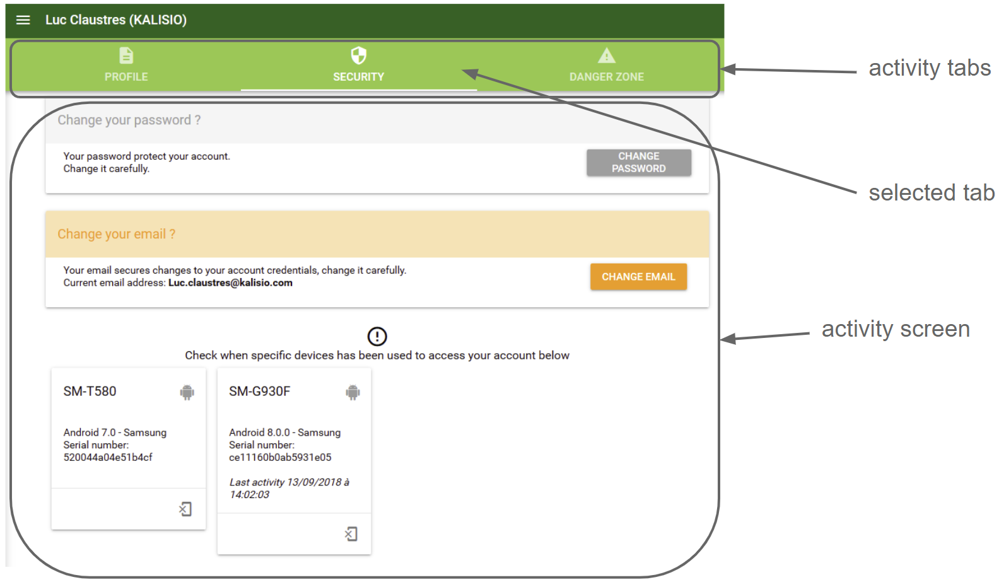

# Basics

Here is a quick rundown of the *key concepts* to handle when you're just getting started with Akt'n'Map.

This presentation comes with small *tutorials* that can be directly run on the application. Thus, you will first have to follow the required steps to create your account then connect to make everything works as expected.

A link can allow you to execute the tutorial directly from the documentation, otherwise open the application at the right place then click on the following icon <a href=""><i class="las la-question-circle"/></a>. You can then follow the step by step guide <a href=""><i class="las la-chevron-left"/></a>, go back if required <a href=""><i class="las la-chevron-right"/></a> and stop anytime <a href=""><i class="las la-times"/></a> as illustrated by the following figure:

::: warning
Akt'n'Map look and features are ever-evolving. As a consequence, your screen probably looks a little different than what you can read and see in this documentation but the key concepts remain the same.
:::

## <i class="las la-user"></i> User

A *person* who has been **registered** to Akt'n'Map. This can be done through two ways:
  * by creating his own **account** on the application,
  * by being *invited* within an organisation by another user of the application.

:point_right: Don't yet have an account and wish to create one ? <tour-link text="How to create an account" path="register"/>

:point_right: Already have an account but cannot connect ? <tour-link text="How to connect" path="login"/>

:point_right: You have created your account and successfully connect ? <tour-link text="Browse the main menu" path="home" :params="{ tour: 'home' }"/>

## Activity

An **activity** is the entry point used in the application for interacting with the user on a given type of objects. It usually represents a single screen with a dedicated user interface. When multiple screens are required due to the large number of possible actions, each one is displayed as a **tab**. Selecting a tab switch the user interface to the associated screen. 

For instance, what is related to your account and its security is managed in a specific account activity composed of three screens, as illustrated by the following figure:

## <i class="las la-user-friends"></i> Organisation

A *shared workspace* between users where you can invite people to join and collaborate, notably to manage **events**. Before performing some tasks in a organisation you must select it as you current *context* or workspace.

How to enter into the context of an organisation through the <tour-link text="main menu" path="home" :params="{ tour: 'home' }"/>

A user can belong to *multiple* organisations. In this case a *dashboard* summarizes the running events on the home page.

:point_right: You belong to *multiple* organisations ? <tour-link text="Open your dashboard" path="dashboard"/>

A user can also create new organisations.

:point_right: You'd like to create a new organisation ? <tour-link text="How to through the main menu" path="home" :params="{ tour: 'home' }"/>

A user is being assigned *different roles* in his organisations so that different features are available depending on the currently selected organisation. The following figure shows a use case where:
* a user belongs to multiple organisations (1, 2 and 3),
* a user manages multiple organisations (2),
* an organisation has multiple groups (3),
* a member of an organisation appartenient à plusieurs groupes (3).

### <i class="las la-graduation-cap"></i> Role

A **role** assign you different *rights* inside an organisation or a group:
  * as a <i class="las la-user"></i> *member* you cannot update the organisation or the group (view right),
  * as a <i class="las la-briefcase"></i> *manager* you can also change the state of the organisation or the group (update right),
  * as a <i class="las la-certificate"></i> *owner* you can also delete the organisation or the group (full access).

::: tip
Rights are cumulative, a owner (respectively manager) owns all rights of a manager (respectively member).
:::

The manager of an organisation can:
  * manage **members** of this organisation,
  * create **groups** within this organisation and manage members of these groups.
The owner can as well detroy the organisation and manage payment means.

The manager of a group can manage **members** of this group. The owner can as well detroy the group.

::: tip
By creating an organisation or a group you become the owner by default but you can share this responsibility with others by assigning them new rights on this organisation or group.
:::

### <i class="las la-sitemap"></i> Group

A **group** allows to *delegate* the management of a shared workspace limited to its members. Users outside the group will not see it, neither its members.

:point_right: You manage an organisation ? <tour-link text="How to manage your groups" path="home" :params="{ organisation: 'manager', route: 'groups-activity' }"/>

::: details See also
How to enter into the context of an organisation through the <tour-link text="main menu" path="home" :params="{ tour: 'home' }"/>

How to enter the groups management activity from the <tour-link text="context of your organisation" path="home" :params="{ organisation: 'manager', tour: 'context' }"/>
:::

### <i class="las la-tags"></i> Tag

A **tag** allows to *classify* a subset of your organisation members according to a *business criterium* (e.g. a skill or a service).

A tag is *transverse* to your organisation, meaning you can target with it people having the same criteria in different groups.

:point_right: You manage an organisation ? <tour-link text="How to manage your tags" path="home" :params="{ organisation: 'manager', route: 'tags-activity' }"/>

::: details See also
How to enter into the context of an organisation through the <tour-link text="main menu" path="home" :params="{ tour: 'home' }"/>

How to enter the tags management activity from the <tour-link text="context of your organisation" path="home" :params="{ organisation: 'manager', tour: 'context' }"/>
:::

## <i class="las la-fire"></i> Event

An *information about a fact* to be shared between some members of an organisation. Typical events are interventions, crisis management actions, etc.

Events generate *notifications* on mobile devices of **participants** who have installed the mobile application when created, updated and removed by its **coordinators**.

The participants and coordinators of an event can be selected as:
  * individual members,
  * groups,
  * tags.

::: tip
By creating an event you become the coordinator by default but you can share this responsibility with others by make them a coordinator as well.
:::

Akt'n'Map allows to attach to each event:
  * *pictures* or *documents* shared among participants,
  * a **[processes](../gofurther/processes.md)** defining interactions between participants and coordinators.

:point_right: Ready to share some information ? <tour-link text="How to manage your events" path="home" :params="{ organisation: 'member' }"/>

### Event templates

An event is always created from a **template** that define its basic content. Each model includes a default title, description and/or set of participants. This way, when creating an event, only remains to complete or update some elements like the localisation.

::: tip Astuce
Usually, models follow a business oriented typology. For instance fire fighters would have the following templates: *Forest fire*, *Individual rescue operation* or *Public road accident*.

Using a typology you can produce **[relevant statistics](../gofurther/archiving.md)** from your events.
:::

:point_right: You manage an organisation ? <tour-link text="How to manage your templates" path="home" :params="{ organisation: 'manager', route: 'event-templates-activity' }"/>

::: details See also
How to enter into the context of an organisation through the <tour-link text="main menu" path="home" :params="{ tour: 'home' }"/>

How to enter the models management activity from the <tour-link text="context of your organisation" path="home" :params="{ organisation: 'manager', tour: 'context' }"/>
:::

### Participant

A participant cannot modify an event although he can share documents and pictures.

### Coordinator

A coordinator can update and close (i.e. destroy) an event, and change its set of participants and coordinators.

His has also access to a *cartographic view* summarizing the position and state of each participant according to the [process](../gofurther/processes.md).

