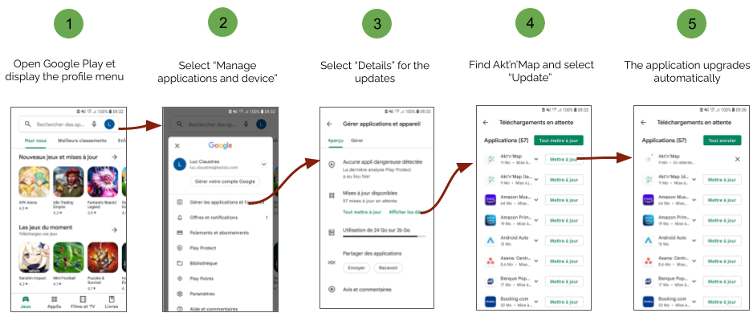
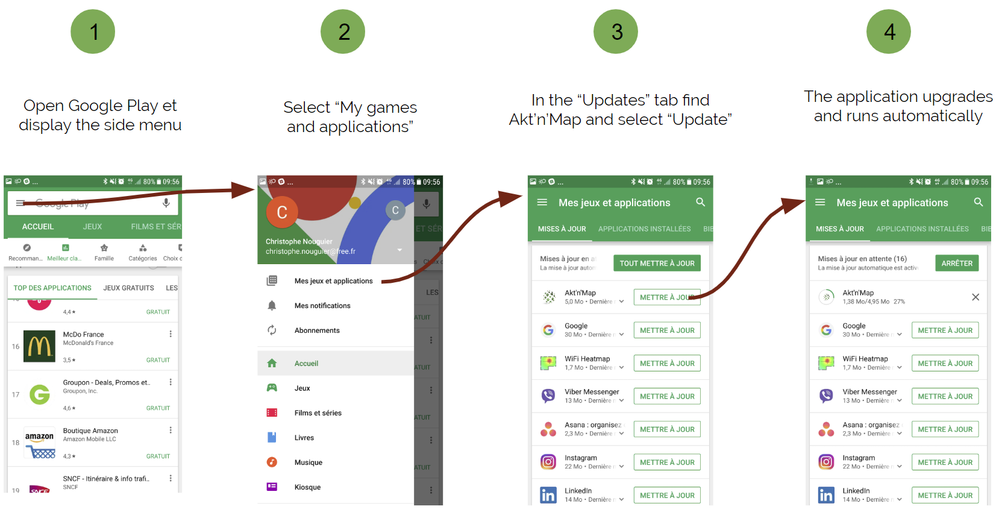

# Update

## Web application

The web application does not require any update workflow. When we update our online services this is done automatically.

## Mobile applications

Usually applications that you download are automatically updated. However, this might not be automatic in some cases (specific device configuration, no Wi-Fi network access, etc.), so that you will need to proceed manually.

::: warning Information
When we update our online services your mobile application might display a message about a version mismatch, it's time to update it !
:::

### Android

When a new version is available follow one of these procedures to update depending on your Android version:

Or:

### iOS

1. Open the App Store, then tap *"Updates"* at the bottom of the screen.
2. Scroll down to find Akt'n'Map then tap *"Update"* next to the app to update it.